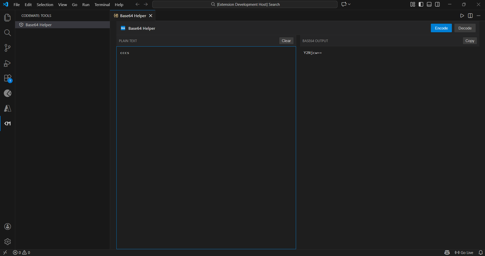
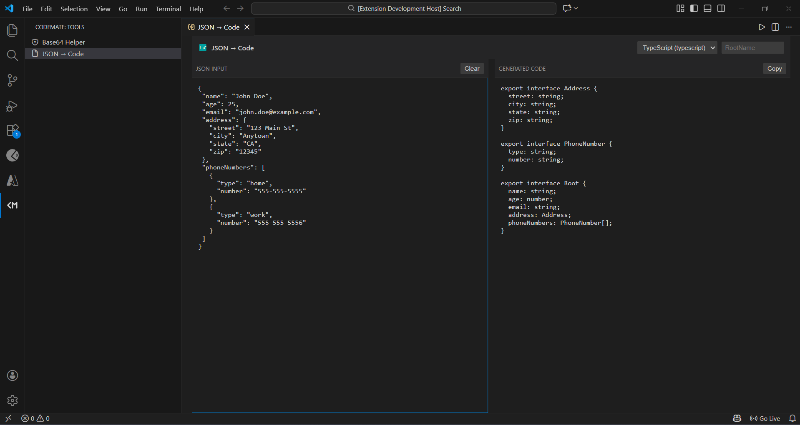
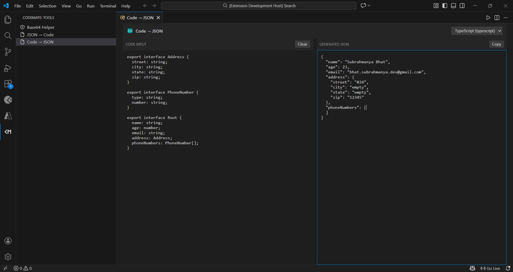

<h1 style="text-align: center;">Codemate ToolKit</h1>

Codemate Toolkit is a lightweight Visual Studio Code extension that provides essential utility tools for developers. 

## Tools
### 🚀Base 64 Helper
A Base64 utility for quickly encoding and decoding strings.

### 🚀 JSON to Code Generator

Stop writing boilerplate. Instantly generate strongly-typed models, classes, and structs from your JSON objects.

**JSON to Code** allows you to paste a JSON object and automatically converts it into a ready-to-use class or struct in your language of choice. It infers data types, handles nesting, and produces clean, syntax-highlighted code.

#### ✨ Key Features

* **Instant Conversion:** Zero latency; get your code immediately.
* **Deep Nesting Support:** Automatically generates helper classes for nested JSON objects.
* **Type Inference:** Smartly detects integers, floats, booleans, strings, and nullables.

#### 🛠 Supported Languages

Currently, the tool supports conversion to the following languages:

| Language | Output Format |
| :--- | :--- |
| **TypeScript** | Interfaces / Types |
| **JavaScript** | ES6 Classes / Proptypes |
| **C#** | Classes with Properties |
| **Java** | POJO Classes |
| **Python** | Dataclasses / Pydantic models |
| **Go** | Structs with JSON tags |
| **Kotlin** | Data Classes |
| **Ruby** | Classes / Hash initializers |

#### Usage

1.  Paste your raw JSON into the input editor.
2.  Select your target language from the dropdown.
3.  Copy the generated code and use it in your project!

### 🚀 Code to Json Generator
Instantly transform your data models and classes into formatted JSON samples. Perfect for generating API documentation, mock data, or config files directly from your source code.

Code to JSON parses your language-specific data structures (like C# Classes, Python Dataclasses, or TypeScript Interfaces) and generates a matching JSON object. No more manually typing out keys and dummy values, just select your code and convert!

#### 🌍Supported Language Inputs

| Input Language | Structure Handled | Output Feature |
| :--- | :--- | :--- |
| **TypeScript** | `Interfaces & Types` | Resolves nested types and optional fields. |
| **JavaScript** | `ES6 Classes & Objects` | Converts property assignments to JSON. |
| **C#** | `Classes & Properties` | Maps PascalCase properties to JSON keys. |
| **Java** | `POJO / Bean Classes` | Respects field types and standard naming. |
| **Python** | `Dataclasses / Pydantic` | Handles type hints and default values. |
| **Go** | `Structs with Tags` | Uses `json:"key"` tags to name JSON fields. |
| **Kotlin** | `Data Classes` | Handles primary constructor properties. |
| **Ruby** | `Classes & Initializers` | Maps instance variables to JSON keys. |

## Contributing

Contributions are welcome. Open issues or pull requests with a clear description and tests for behavior changes.

## License

MIT
